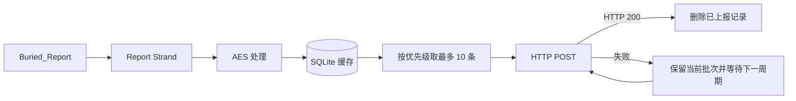

# BuriedPoint

[](https://github.com/lintingfeng2001/BuriedPoint/actions/workflows/ci.yml)

BuriedPoint 是一个面向 Windows 的 C++20 埋点上报库。应用通过一组精简的 C 风格接口提交事件；事件会先异步写入本地 SQLite 缓存，再由后台任务按优先级批量发送到 HTTP 服务。

当前仓库可以构建静态库和共享库，并提供 GoogleTest 测试、示例程序以及一个用于本地联调的 Rust 模拟接收服务。

## 主要能力

- 通过 `Buried_Create`、`Buried_Start`、`Buried_Report` 和 `Buried_Destroy` 提供精简的公开接口。
- 将事件异步持久化到 SQLite，避免网络暂时不可用时立即丢失内存中的上报数据。
- 在写入数据库前对缓存内容进行 AES 处理；后台每轮结束后默认等待约 5 秒，再按优先级读取最多 10 条事件。
- 使用项目自有的 `buried::Strand` 串行执行器协调数据库写入、定时器和上报生命周期。
- 同时支持 `Buried_static` 和 `Buried_shared` 构建目标。
- 在 GitHub Actions 中使用 Windows + MSYS2 MinGW64 持续构建和测试。

## 工作流程



`Buried_Report` 返回成功仅表示事件已被接受并进入 Strand 队列，不表示它已经写入 SQLite，更不表示远端服务已经收到该事件。HTTP 请求失败时，当前批次及其数据库记录都会保留，等待后续周期直接重试。

## 平台与工具链

当前实现是 **Windows 专用**：源码直接使用 Windows API，并链接 `winmm`、`iphlpapi`、`ws2_32`、`dbghelp` 和 `Kernel32`。

构建要求：

- CMake 3.20 或更高版本。
- C++20 和 C11 编译器。
- 推荐使用 MSYS2 MinGW64 GCC 与 Ninja；本地和 CI 均已验证该组合。
- AddressSanitizer 配置使用 Visual Studio 2022 工具链、`clang-cl`、
  C++ AddressSanitizer 组件和 Windows SDK。
- 使用仓库中的 `mingw-debug` preset 时需要 CMake 3.25 或更高版本，因为 `CMakePresets.json` 使用 schema v6。
- Rust/Cargo 仅在运行可选的本地模拟服务时需要。

仓库已包含 Boost.Asio/Beast、spdlog、mbedTLS、SQLite/sqlite_orm、nlohmann/json 和 GoogleTest 等 C++ 依赖，不需要额外的 C++ 包管理器。

> 普通开发和主 CI 使用 MinGW64；ASan 构建使用 Visual Studio 的
> `clang-cl` 工具集。原生 `cl.exe` 构建仍未单独验证。

## 构建

### 通用 MSYS2 MinGW64 构建

在 MSYS2 MINGW64 shell 中安装工具链：

```bash
pacman -S --needed \
  mingw-w64-x86_64-gcc \
  mingw-w64-x86_64-cmake \
  mingw-w64-x86_64-ninja
```

使用与 CI 等价的配置构建项目：

```bash
cmake -S . -B build/ci -G Ninja \
  -DCMAKE_BUILD_TYPE=Debug \
  -DCMAKE_C_COMPILER=gcc \
  -DCMAKE_CXX_COMPILER=g++ \
  -DBUILD_BURIED_TEST=ON \
  -DBUILD_BURIED_EXAMPLES=ON

cmake --build build/ci --parallel 4
```

### 维护者已验证的本机 preset

本仓库还提供 `mingw-debug` preset：

```powershell
cmake --preset mingw-debug
cmake --build --preset mingw-debug
```

该 preset 固定引用以下路径，因此只适用于工具安装位置一致的机器：

```text
D:/software/msys2/mingw64/bin/gcc.exe
D:/software/msys2/mingw64/bin/g++.exe
D:/software/msys2/mingw64/bin/ninja.exe
```

其他环境请使用前面的通用命令，或复制 preset 后调整编译器和 Ninja 路径。

### CLion + clang-cl AddressSanitizer

Windows 下的 ASan 配置不会替换现有 MinGW Profile。先在 Visual Studio
Installer 的“使用 C++ 的桌面开发”中安装：

- C++ AddressSanitizer
- 适用于 Windows 的 C++ Clang 编译器
- MSVC v143 x64/x86 生成工具和 Windows SDK

然后在 CLion 中完成以下设置：

1. 打开 **Settings | Build, Execution, Deployment | Toolchains**。
2. 新建 Visual Studio Toolchain，架构选择 `amd64`。
3. 将 C 和 C++ 编译器指向 Visual Studio 安装目录下的
   `VC/Tools/Llvm/x64/bin/clang-cl.exe`。
4. 在 **Settings | Build, Execution, Deployment | CMake** 中启用
   `clang-cl-asan` preset/Profile。该 preset 已选择 `RelWithDebInfo`，并使用
   CLion Toolchain 中配置的 Ninja。
5. 构建 `buried_test`，然后直接从 CLion 运行测试。

也可以在 Visual Studio Developer PowerShell 中执行以下命令，但需要先
确保 Ninja 位于 `PATH`，或通过 `CMAKE_MAKE_PROGRAM` 指定其路径：

```powershell
cmake --preset clang-cl-asan
cmake --build --preset clang-cl-asan
.\build\clang-cl-asan\tests\buried_test.exe `
  --gtest_color=yes
```

ASan 发现越界访问、Use-After-Free、Double-Free 等错误时会输出调用栈并使
测试失败。该 preset 使用独立的 `build/clang-cl-asan` 目录，不会污染
`build/mingw-debug`。构建过程会把匹配的 ASan 运行库 DLL 复制到测试和示例
程序旁边，因此从 CLion 直接运行时不需要手工修改 `PATH`。

### CMake 选项

| 选项 | 默认值 | 说明 |
| --- | ---: | --- |
| `BUILD_BURIED_SHARED_LIBS` | `ON` | 构建 `Buried_shared` |
| `BUILD_BURIED_STATIC_LIBS` | `ON` | 构建 `Buried_static` |
| `BUILD_BURIED_EXAMPLES` | `OFF` | 构建示例程序 |
| `BUILD_BURIED_TEST` | `OFF` | 构建 GoogleTest 测试程序 |
| `BUILD_BURIED_FOR_MT` | `OFF` | 使用 MSVC 时切换到 `/MT` 或 `/MTd` |
| `ENABLE_ASAN` | `OFF` | 为项目库、测试和示例启用 AddressSanitizer |

测试程序依赖 `Buried_static`。完整示例集同时链接静态库和共享库；启用 `BUILD_BURIED_EXAMPLES` 时应保留两种库目标。

### 主要构建产物

MinGW Debug 构建会生成：

```text
<build-dir>/src/libBuried_static.a
<build-dir>/src/libBuried_shared.dll
<build-dir>/src/libBuried_shared.dll.a
```

使用共享库时，需要将 `libBuried_shared.dll` 放在可执行文件旁，或确保它位于运行时 `PATH` 中。

## 测试与 CI

通用构建目录：

```bash
./build/ci/tests/buried_test.exe --gtest_color=yes
./build/ci/examples/context_example.exe
```

`mingw-debug` preset：

```powershell
.\build\mingw-debug\tests\buried_test.exe --gtest_color=yes
.\build\mingw-debug\examples\context_example.exe
```

只检查测试程序和工具链能否启动：

```powershell
.\build\mingw-debug\tests\buried_test.exe --gtest_list_tests
```

测试程序当前未注册到 CTest，因此需要直接运行 `buried_test.exe`。

[GitHub Actions CI](https://github.com/lintingfeng2001/BuriedPoint/actions/workflows/ci.yml) 会在以下场景自动运行：

- 向 `master` 推送提交。
- 创建或更新目标为 `master` 的 Pull Request。

CI 包含两个独立任务：

- `Windows MinGW64`：执行普通 Debug 构建、GoogleTest 和 `context_example`。
- `Windows clang-cl ASan`：执行 `clang-cl` ASan 构建，并在 ASan 运行库下
  再次运行 GoogleTest 和 `context_example`。

当前两个标记为 `DISABLED_` 的数据库/HTTP 测试不会执行，CI 也不会启动
Rust 模拟服务，因此真实 HTTP 上报链路仍需要单独进行本地集成测试。

## 快速使用

公开头文件位于 [`include/buried.h`](include/buried.h)。接口采用 C linkage，但当前头文件、示例和构建流程以 C++ 为主；尚未验证将其作为纯 C SDK 使用。

```cpp
#include <chrono>
#include <filesystem>
#include <thread>

#include "include/buried.h"

int main() {
  const auto work_dir =
      (std::filesystem::current_path() / "runtime").string();

  Buried* client = Buried_Create(work_dir.c_str());
  if (!client) {
    return 1;
  }

  BuriedConfig config{};
  config.host = "127.0.0.1";
  config.port = "5678";
  config.topic = "/buried";
  config.user_id = "demo-user";
  config.app_version = "1.0.0";
  config.app_name = "demo-app";
  config.custom_data = R"({"channel":"readme"})";

  if (Buried_Start(client, &config) != 0) {
    Buried_Destroy(client);
    return 2;
  }

  if (Buried_Report(client, "app_started",
                    R"({"source":"example"})", 10) != 0) {
    Buried_Destroy(client);
    return 3;
  }

  // 仅用于演示等待一次 5 秒上报周期；实际应用通常让 client
  // 存活于应用生命周期内。
  std::this_thread::sleep_for(std::chrono::seconds(6));
  Buried_Destroy(client);
  return 0;
}
```

配置说明：

| 字段 | 说明 |
| --- | --- |
| `host` | HTTP 服务主机名或 IP 地址 |
| `port` | HTTP 服务端口 |
| `topic` | HTTP POST 请求目标，建议使用 `/buried` 形式的路径 |
| `user_id` | 业务用户标识；请勿在示例或测试中提交真实用户数据 |
| `app_version` | 接入应用版本 |
| `app_name` | 接入应用名称 |
| `custom_data` | 附加元数据，必须是有效 JSON 文本；不需要时可传 `{}` |

有效上报需要可用的 `host`、`port`、`topic` 和 `custom_data`。配置字符串会在 `Buried_Start` 调用期间复制，调用返回后不要求继续保留原始字符指针。

`priority` 请使用 `0..INT32_MAX` 范围；在该范围内数值越大，事件越早从缓存中取出。公开头文件当前没有导出结果枚举，调用方应将返回值 `0` 视为请求已接受，非 `0` 视为失败。`Buried_Start` 的数据库初始化也是异步操作，初始化失败目前只会写入运行日志。

## 本地模拟接收服务

`server/` 提供一个监听 `0.0.0.0:5678` 的 Rust HTTP 服务，收到 POST 请求后打印请求内容并返回 HTTP 200。

```powershell
cargo run --manifest-path server/Cargo.toml
```

首次运行时，Cargo 会从 crates.io 下载依赖。保持服务运行并在另一个终端启动示例：

```powershell
.\build\mingw-debug\examples\buried_example.exe
```

## 运行时文件与日志

调用 `Buried_Create(work_dir)` 后，库会在以下位置创建运行数据：

```text
<work_dir>/buried/buried.db
<work_dir>/buried/buried.log
```

- `buried.db` 保存尚未成功上报的 SQLite 缓存数据。
- `buried.log` 记录程序运行、缓存和 HTTP 上报情况，同时日志也会输出到控制台。
- 当前日志文件在重新初始化同一工作目录时会被截断，因此不能把它当作永久审计日志。
- Windows 设备标识保存在当前用户注册表的 `HKCU\Software\Buried\device_id` 下。

运行日志与源码修改记录是两类信息。源码修改历史请查看：

- [Commit 历史](https://github.com/lintingfeng2001/BuriedPoint/commits/master/)
- [Pull Requests](https://github.com/lintingfeng2001/BuriedPoint/pulls)
- [GitHub Actions 记录](https://github.com/lintingfeng2001/BuriedPoint/actions)
- [项目自有 Strand 的首次实现 PR #1](https://github.com/lintingfeng2001/BuriedPoint/pull/1)

## 项目自有 Strand

`src/context/strand.*` 实现了项目内部使用的串行执行器。它绑定到 Boost.Asio `io_context`，保证同一个 Strand 接受的任务按队列串行执行，并提供：

- `Post`：异步提交任务，不内联执行。
- `Wrap`：将回调重新投递到对应 Strand。
- `Close`：选择排空或取消尚未执行的任务；取消模式不会中止正在执行的 handler。
- `WaitIdle`：在非 Strand 执行线程等待队列空闲；从自身 handler 调用时不会阻塞，而是返回 `false`。
- `RunningInThisThread` 和 `IsOpen`：查询当前状态。

它只实现了 BuriedPoint 当前需要的行为，并不是 Boost.Asio strand 或通用 Asio executor 的完整替代品。定时器、网络通信等功能仍然使用 Boost.Asio/Beast。

## 项目结构

| 路径 | 说明 |
| --- | --- |
| `include/buried.h` | 公开接口与配置结构 |
| `src/context/` | 全局执行上下文和项目自有 Strand |
| `src/report/` | 缓存调度与 HTTP 上报 |
| `src/database/` | SQLite 持久化 |
| `src/crypt/` | 本地缓存内容处理 |
| `src/common/` | 系统、设备和公共元数据 |
| `examples/` | 公开接口与内部组件示例 |
| `tests/` | GoogleTest 回归测试 |
| `server/` | Rust 本地模拟 HTTP 接收服务 |

## 当前限制

- 仅验证 Windows 上的 MSYS2 MinGW64 和 Visual Studio `clang-cl` ASan
  配置，尚未提供跨平台实现。
- 上报使用明文 HTTP，不支持 HTTPS/TLS。
- 本地 AES 使用项目内固定方式派生密钥，只能视为缓存内容处理，不能作为生产级密钥保护方案。
- 当前上报机制不承诺 exactly-once 或端到端送达保证。
- `custom_data` 必须是有效 JSON；无效内容目前可能导致解析异常。
- Windows ASan 不等同于完整的内存泄漏检测；仍需结合 Visual Studio
  Diagnostics 等工具检查未释放但未发生非法访问的内存。
- 仓库目前没有根级 `LICENSE` 文件，请勿自行推定代码授权范围。
